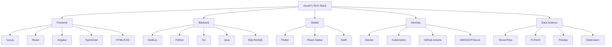

# Technical Skills

## Overview

I have experience with a wide range of technologies, programming languages, frameworks, and tools. My technical skills have been developed through formal education, professional work experience, personal projects, and continuous self-learning.

## Core Competencies

- **Software Architecture**: Designing scalable and maintainable software systems
- **Full-Stack Development**: End-to-end application development
- **API Design**: Creating RESTful and GraphQL APIs
- **Database Design**: Schema design, query optimization, data modeling
- **Cloud Computing**: Deploying and managing cloud infrastructure
- **DevOps**: CI/CD pipelines, containerization, infrastructure as code
- **Testing**: Unit testing, integration testing, end-to-end testing
- **Performance Optimization**: Profiling and improving application performance

## Technology Stack

Below is a visual representation of my technology stack:

## Skill Assessment

A self-assessment of my proficiency in various technologies (on a scale of 1-5):

| Technology | Proficiency |
|------------|-------------|
| JavaScript | ★★★★★ |
| TypeScript | ★★★★★ |
| Python | ★★★★☆ |
| Vue.js | ★★★★★ |
| React | ★★★★☆ |
| Node.js | ★★★★★ |
| Go | ★★★☆☆ |
| Flutter | ★★★★☆ |
| SQL | ★★★★☆ |
| MongoDB | ★★★★☆ |
| AWS | ★★★★☆ |
| Docker | ★★★★☆ |
| Kubernetes | ★★★☆☆ |
| CI/CD | ★★★★☆ |
| Machine Learning | ★★★☆☆ |

## Continuous Learning

I'm currently expanding my knowledge in:

- Rust programming language
- WebAssembly
- Serverless architecture
- Blockchain technology
- Advanced machine learning techniques 